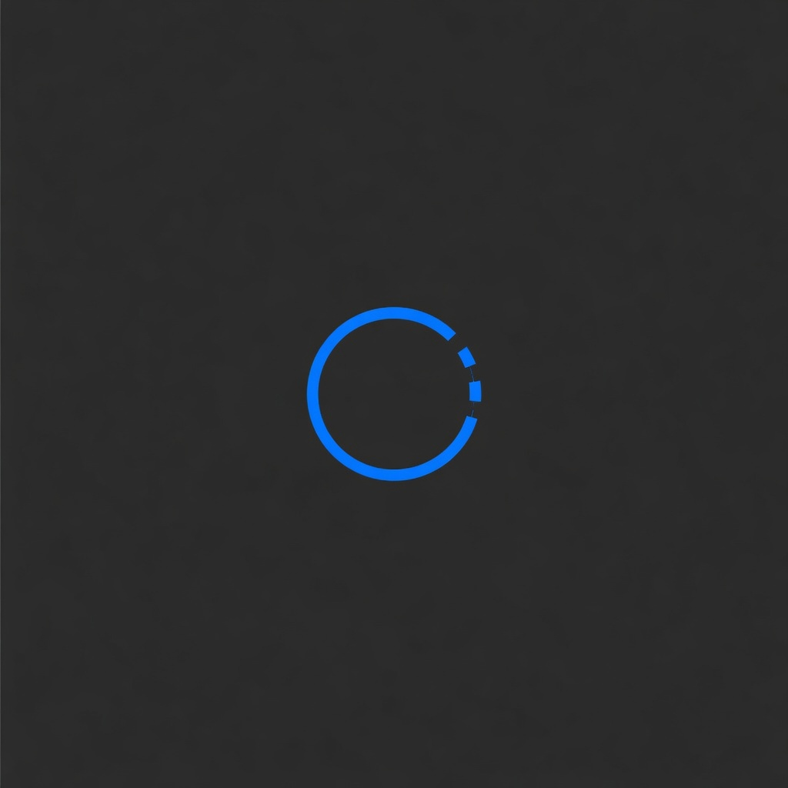

# br0x



br0x is a minimal browser for Linux. It uses Rust, GTK4, and WebKitGTK. It runs less on purpose: idle tabs release their memory, trackers are refused before they load, and your data stays on your machine.

## Goals

- Use a fraction of the memory mainstream browsers need for the same tabs.
- Start fast and switch tabs instantly.
- Keep the UI native to GNOME.
- Stay offline first. No account. No telemetry.

## Stack

- Rust 2024 edition
- GTK4 plus libadwaita for the shell
- WebKitGTK 6.0 for page render
- Flatpak for release builds, AUR for Arch installs

## What works today

- Tabs with favicons, titles, close buttons, and a native tab bar (Ctrl+T, Ctrl+W)
- Built-in start page: search box, real favicons, Frequent sites, Bookmarks, quick links, your own pinnable shortcuts, engine aware
- Address bar with search fallback, live history suggestions, and a search engine picker (DuckDuckGo, Google, Brave, Bing, Startpage, Wikipedia)
- Lock icon for https, warning icon for http, magnifier on empty pages, clear button, bookmark star, pill shaped entry
- Bookmarks: star button, Ctrl+D, menu entry, start page section
- Back, forward, reload, stop, and zoom (single toast, no pile-up)
- Find in page with live match count (Ctrl+F)
- `window.open` and `target=_blank` open real tabs
- Session save and restore. Only the selected tab loads at startup, the rest stay parked until you visit them
- Adaptive park policy: idle background tabs release their web process under memory pressure. Tabs that are audible, loading, blank, pinned, or recently restored are exempt. Parked tabs are marked `• Parked`
- Reopen closed tab (Ctrl+Shift+T, last 10)
- Base tracker block list compiled once and attached to every view
- Memory pressure settings on the shared web context
- Modern Chrome user agent plus persistent cookies, so Google search works without captcha loops

## Keyboard shortcuts

| Keys | Action |
| --- | --- |
| Ctrl+T | New tab |
| Ctrl+W | Close tab |
| Ctrl+Shift+T | Reopen closed tab |
| Ctrl+L, Ctrl+K | Focus address bar |
| Ctrl+F | Find in page |
| Ctrl+G, Ctrl+Shift+G | Next, previous match |
| Ctrl+R, F5 | Reload |
| Escape | Close find bar, or stop loading |
| Alt+Left, Alt+Right | Back, forward |
| Ctrl+Plus, Ctrl+Minus, Ctrl+0 | Zoom in, out, reset |
| Ctrl+Tab, Ctrl+Shift+Tab | Next, previous tab |
| Ctrl+D | Bookmark this page |
| Alt+Enter | Open address in new tab |
| Ctrl+Q | Quit |

## Install

- Arch (AUR): `yay -S br0x` (ships `br0x`, a launcher entry, and an icon).
- Release tarball: download `br0x-<version>-x86_64.tar.gz` from
  GitHub Releases, then `./install.sh --prefix ~/.local`.
  Needs `gtk4`, `libadwaita`, and `webkitgtk-6.0` from your distro.
- Flatpak: `flatpak-builder --force-clean build-dir .flatpak/org.br0x.Browser.yml`.
- From source: install deps, then `./scripts/install.sh` for a launcher entry.

Install deps on Arch:

```sh
sudo pacman -S --needed base-devel pkgconf gtk4 libadwaita webkitgtk-6.0 rustup \
  gst-plugins-good gst-libav gst-plugins-bad
rustup default stable
```

Run from source:

```sh
cargo run --release -p br0x-shell-gtk
```

Media sites need the GStreamer packages. Without them the web process crashes
when a page initializes audio.

## Measuring memory

```sh
./scripts/measure.py firefox br0x
```

Reports proportional set size (PSS) for each process tree, which counts shared
pages once instead of once per process.

## Project layout

- `crates/br0x-core`: policy, lifecycle, session store, blocker, sampler. No GTK code here.
- `crates/br0x-shell-gtk`: GTK4 window, tabs, address bar, park wiring. Calls `br0x-core`.
- `docs/adr/`: architecture decisions.
- `packaging/`: desktop entry, app metadata, and icon.
- `PKGBUILD`: AUR package for Arch installs.
- `.flatpak/`: Flatpak manifest for release builds.

## Contributing

Read `CONTRIBUTING.md`, then open a small PR. Maintainers review within 7 days.
